# 1. Getting started with QGIS

This tutorial is a step-by-step introduction to QGIS, from discovering the GUI to geospatial processing, through a series of practical exercises based on the geohistorical data leveraged in the DigiKAR project.

A set of icons is used to highlight the nature of specific blocks or sections:

- ⚠️ and ❗ denote an important information;
- ℹ️ is used for optional info or details on a specific point.
- 🛠️ marks the beginning of an "exercise". Now it's your turn!
- The icon   is used to remind you to save the project to prevent data loss if QGIS crashes !

>❗ **LANGUAGE.**
> All exercices have been written with QGIS in English.
Going through the tutorial with QGIS in German should not be too difficult, as most features have a distinctive icon image.
However, if you installed QGIS in German and wish to temporarily switch to English, once you have run QGIS open the menu `Settings->Options->Locale`, check `Override system locale` and set to `🇺🇸 American English`.
QGIS must be restarted for changes to take effect.

>❗ **REMINDERS**

>1. Save your QGIS project **regularly**, the software might not be super stable on your computer, especially if your OS is Windows !
>2. When editing vector data, don't forget to save the layer also **regularly** !
>3. Be carefull with character encoding on Windows when loading geodata from local files, as the default encoding is usually not `UTF-8` on this OS. Similar issues may or may not occur on MacOS...

> ⚠️ **DISCLAIMER**.
Some of the data and documents used in this tutorial are extracts from datasets created by other organizations that are not always available as open data.
We therefore ask you not to distribute or publish the content of this tutorial.

Lastly, apologies for all the *frenchisms* in the text 🙂

# A. Preliminary steps

## a. Setting up the working directory
1. Create a new folder in the location of your choice to store the material and projects of the next tutorials. This folder will be your working directory.
2. Download the data for this tutorial (~1.5Mb): [https://www.swisstransfer.com/d/64cf26cf-2824-4ae0-9dbe-be09ff12a4f5](https://www.swisstransfer.com/d/64cf26cf-2824-4ae0-9dbe-be09ff12a4f5)
3. Extract the zip archive to your working directory.## b. Creating a new QGIS project 
Before starting to experiment with the GUI, let's start by creating a project to hold all the data and configuration of the tutorials.

On start-up, QGIS is initialized with an empty project, labelled `Untilted Project`.

---

> 🛠️

Let's start by saving this new project on the hard disk with a better name; this will be the project for the rest of the hands-on session.

From the QGIS top menu, go to `Project->Save as`, or press `CTRL+Shift+S` and save the project as `main_project` in your working directory (no need to set the file extension).

The top banner of QGIS should now display `main_project` to indicate that this is the currently opened project.

>ℹ️  A project is a workspace, savec in .QGZ files.
Projects store a large number of settings: customisation of the GUI, map projections, links to data sources, the list of loaded GIS layers with their symbolisation, input forms, and so on. 
However, it is important to note that **a project file does not actually store any geospatial data**, but only configurations and metadata.
The actual data may be stored locally in separate files, or may come from remote servers on the Web.


⚠️ Ensure the code `EPSG:4326` apprears in the bottom-right corner of the QGIS footbar (see below). If not, please notify one of the session organisers before proceeding further.


---

# 1. First steps in QGIS
This is the interface you should be seeing now:

The main GUI layout is composed of 3 types of visual components:

- **Menus**, which provide hierarchical access to QGIS functions, options and preferences;
- **Panes**, to display data in different ways, including the main map view.
- **Toolbars**, that are visual shortcuts to all features found in the menus.

Let's discover these different visual elements through hands-on experience.

## a. Loading the OSM basemap with a QGIS Plugin

For the moment, the project is completely blank. Let's fix that by loading OpenStreetMap as our first data source!

>ℹ️ The volunteer geographic information project OpenStreetMap (OSM) creates multi-scale world maps from its open-data geodatabase, and publishes them on the Web for everyone and for free.

QGIS has a plugin that makes it very easy to load OSM basemaps, however is not installed by default.

---

> 🛠️

In the QGIS top menu, go to `Plugins->Manage and Install Plugins...`.
It will open a window listing all the plugins available on the official plugins hub at https://plugins.qgis.org/.

In the tab `All`, search for `QuickMapServices` and click on `Install Plugin`. Once installed, close the popup window.

The `QuickMapServices` plugin is now accessible from the QGIS main menu, in `Web->QuickMapServices`.

In `QuickMapServices`, select `OSM->OSM Standard` to load the standard OSM basemap into the project.

>ℹ️ QGIS comes with over 1,000 plugins for all kinds of uses, so feel free to explore [https://plugins.qgis.org/](https://plugins.qgis.org/)! Please note that some plugins, although open-source, serve as access points to commercial APIs (e.g. MapTiler).

---

### b. Navigating in the map

In `QuickMapServices`, click `OSM->OSM Standard` to load the default OpenStreetMap basemap into QGIS.


>ℹ️  The map may not have the same shape as in the figure above; it depends on the default cartographic projection used in your QGIS.

Let's explore some of the most important components of the QGIS GUI: the map navigation tools (1), the map view (2), and the Layers pane (3).

The **Map navigation tools (1)** take up a small part of the QGIS toolbar, usually in the top left. 
They are used to navigate within the map view (2) in various ways.

>ℹ️ Feel free to hover your mouse over the different tools to display their tooltips!

Most QGIS map tools work in a similar way. Clicking on a tool **activates** it, wich often makes the mouse cursor to change accordingly.
The tool can then be **used** on the map view (2). In some cases, clicking on the tool icon immediately triggers an action, such as `Zoom Full`, which zooms to the extent of all currently mapped data.

Note that the OSM basemap also appears in the  **Layers (3)** pane. If you uncheck the box next to `OSM Standard`, it will hide that layer in the map view.

---

> 🛠️

Use the `Pan` and `Zoom` tools on the **map view (2)** to roughly position yourself over Saxony. :info: With the `Zoom` tool, you can draw a rectangle on the map to easily zoom to a specific area. 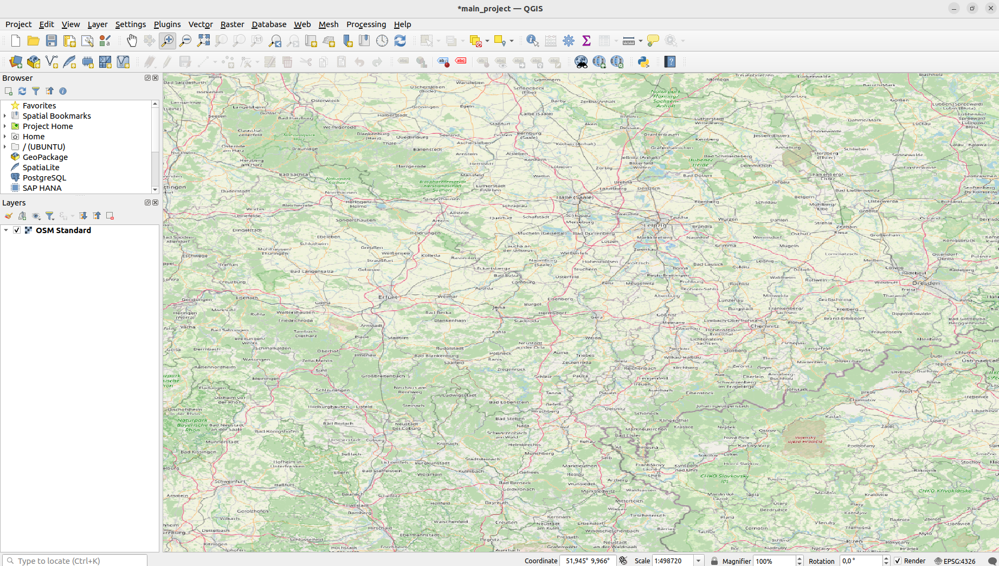

>ℹ️  You can set the map view to a specific scale by editing the Scale value in the QGIS footbar. For instance, set the scale to 1:500,000. 


  Now it's time to save the project state. Go to the `Project->Save` menu, press `CTRL+S`, or use the `floppy disk` tool . Saving the QGIS project stores the scale and position of the view, so every time you reopen the project, you will be in the same place.

---

# C. Map projections and coordinate reference systems

Perhaps have you noticed that the `OSM Standard` basemap appears stretched in the East-West direction. This is due to the cartographic projection used in the map view of the project.

Let's take a moment to delve into this topic.

### a. Map projections

> Map projections try to portray the surface of the earth, or a portion of the earth, on a flat piece of paper or computer screen. In layman’s term, map projections try to transform the earth from its spherical shape (3D) to a planar shape (2D). <small>[https://docs.qgis.org/3.28/en/docs/gentle_gis_introduction/coordinate_reference_systems.html](https://docs.qgis.org/3.28/en/docs/gentle_gis_introduction/coordinate_reference_systems.html)</small>

Like any GIS, QGIS displays data on a map that is geolocated on the Earth's surface using coordinates. For example, the `OSM Standard` basemap provided by OpenStreetMap is made of thousand of small tiles, each one associated with geographic coordinates.

You can easily observe this by moving the mouse cursor over the map view while looking at the status bar. You will notice that the cursor position is displayed in the `Coordinate` section as latitude and longitude:


Indeed, latitude and longitude are positions on the surface of a spherical or ellipsoidal model of the Earth. However, QGIS is made for 2 dimensional cartography and is unable to show a 3D representation of the Earth.

**Map projections** are mathematical transformations that "unfold" the Earth's surface onto a flat plane while preserving some geometric properties of the terrain, either distances, angles, or shapes.

However, this process is not without consequences, similar to trying to flatten the skin of an orange without cutting it into pieces.
Flattening a sphere can only be done at the expense of distortions, and map projections cannot simultaneously preserve distances, angles, and areas all together.

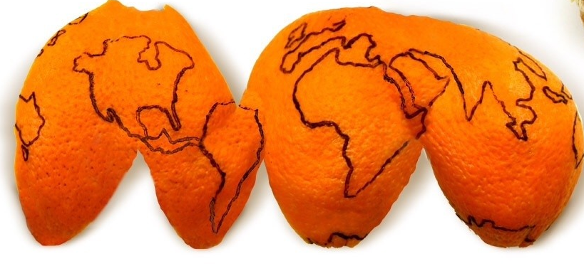
For more information about map projections, see [https://gisgeography.com/map-projections/](https://gisgeography.com/map-projections/)


Numerous map projections are available in QGIS, each with its own geometric properties, pros and cons, area of use, etc. 
Choosing a projection depends on the purpose of the map, its scale, the area to cartography and the use case.
However, the Robinson and Mercator projections are dominant nowadays for small scale cartography (i.e. large areas). Mercator is typically used for world maps. Webmapping applications most often use a simplified version of this projection, called Pseudo-Mercator because it relies on a spherical model of the Earth instead of an ellipsoidal one..


In the current project, QGIS is using a cartographic projection named **[Equirectangular or Plate-Carrée**](https://en.wikipedia.org/wiki/Equirectangular_projection) to display the Earth sphere on a 2 dimensional plane.

You can play around with the demo below [https://www.jasondavies.com/maps/transition/](https://www.jasondavies.com/maps/transition/) to see how different cartographic projections distort the shape of the Earth. Choose `Equirectangular (Plate-Carrée)` in the demo to visualize the projection currently used by QGIS.


As you may notice in the demo or on the map displayed in QGIS, the higher the latitude the more horizontally stretched is the map.
Indeed, the Plate-Carrée projection is not suited for Europe and even less for a "relatively" small area like Germany/Saxony.
However, there are other projections available, integrated into what is known as _Coordinate Reference Systems_ (CRS). 


### b. Coordinate Reference Systems

---

> 🛠️

Notice the code `EPSG:4326` in the bottom right of the footbar of QGIS:


Click on this code to open the `CRS` tab in the project properties.
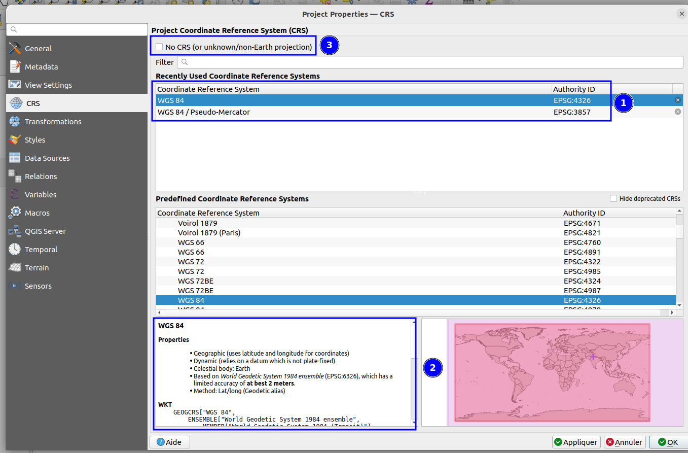

Let's take a closer look at points (1) and (2) from the figure above.

In (1), we can see that the code `EPSG:4326` displayed in QGIS is the **identifier** of the Coordinate Reference System (CRS) named `WGS 84`.

We have seen that map projections exist to display a portion of the surface of the 3D Earth's sphere onto a 2D plane.
A **Coordinate Reference System** is a structured set of parameters that define, in a standardized framework, how to convert geographic coordinates on the Earth's surface (latitude/longitude) to 2D coordinates on a plane using a specific geometric transformation, i.e. a map projection.

>ℹ️  There are thousands of standardized CRS, which can be explored on [https://epsg.io/](https://epsg.io/). Each CRS is tailored to a specific scale, region of the world, accuracy, and usage. 
>It is possible to create custom CRS in QGIS, but that is beyond the scope of this tutorial. 
>Here is a very nice demo to compare different cartographic projections: [https://observablehq.com/@d3/projection-comparison](https://observablehq.com/@d3/projection-comparison)

Let's quickly examine the [CRS `WGS 84 / Pseudo-Mercator`](https://en.wikipedia.org/wiki/Web_Mercator_projection). 
To do this, search for this CRS using the field `Filter`  and select it (you can write the name or the identifier `EPSG:3857`).

In (2), take a look at the `WKT` property, which provides the structured definition of this CRS. Here are the main elements of this CRS:


	------------------------------------------------------------
	BLOCK #0 : DEFINITION
	------------------------------------------------------------
	PROJCRS["WGS 84 / Pseudo-Mercator",
	------------------------------------------------------------
	BLOCK #1 : BASEGEOGCRS
	------------------------------------------------------------
	    BASEGEOGCRS["WGS 84",  
	        ENSEMBLE["World Geodetic System 1984 ensemble",
	        ...
	            ELLIPSOID["WGS 84",6378137,298.257223563,  
	                LENGTHUNIT["metre",1]],  
	            ENSEMBLEACCURACY[2.0]],  
	        PRIMEM["Greenwich",0,  
	            ANGLEUNIT["degree",0.0174532925199433]],  
	        ID["EPSG",4326]],
	------------------------------------------------------------
	BLOCK #2 : MAP PROJECTION
	------------------------------------------------------------
	    CONVERSION["Popular Visualisation Pseudo-Mercator",  
	            ID["EPSG",1024]],  
	        PARAMETER["Latitude of natural origin",0,  
	            ANGLEUNIT["degree",0.0174532925199433],  
	            ID["EPSG",8801]],  
	        PARAMETER["Longitude of natural origin",0,  
	            ANGLEUNIT["degree",0.0174532925199433],  
	            ID["EPSG",8802]],  
	        PARAMETER["False easting",0,  
	            LENGTHUNIT["metre",1],  
	            ID["EPSG",8806]],  
	        PARAMETER["False northing",0,  
	            LENGTHUNIT["metre",1],  
	            ID["EPSG",8807]]],
	    CS[Cartesian,2],  
	        AXIS["easting (X)",east,  
	            ORDER[1],  
	            LENGTHUNIT["metre",1]],  
	        AXIS["northing (Y)",north,  
	            ORDER[2],  
	            LENGTHUNIT["metre",1]],  
	------------------------------------------------------------
	BLOCK #3 : USAGE DOCUMENTATION
	------------------------------------------------------------
	    USAGE[  
	        SCOPE["Web mapping and visualisation."],  
	        AREA["World between 85.06°S and 85.06°N."],  
	        BBOX[-85.06,-180,85.06,180]],  
	    ID["EPSG",3857]]


Without going much details, let's simply observe:

- Block #0: This is a **PROJ[ected]CRS**, meaning it is a CRS with a cartographic projection. With this CRS, the coordinates are in 2 dimensions on a plane! On the other hand, **GEOG[raphic]CRS**, such as the previous `WGS 84` (EPSG:4326), do not carry a map projection; Corodinates in such CRSs are expressed in latitude and longitude. 
- Block #1: This CRS is based on a 3D model of the Earth defined in the CRS `WGS 84`  (EPSG:4326), which contains an ellipsoidal approximation of the true shape of the Earth.
- Block #2: This CRS projects the geographic coordinates on a plane using a mathematical transformation. The parameters for this transformation are described in this block.
- Block #3: Lastly, Block #3 describes the extent to which this CRS is valid, ensuring it is not too imprecise for a particular region of the Earth.

>ℹ️  When using a GEOGCRS like  `WGS 84` (EPSG:4326), QGIS arbitrarily uses an Equirectangular projection when such a CRS is used. This is why, at start, QGIS showed geographic coordinates and displayed a very stretched OSM map.

---

>ℹ️  Nowadays, the most commonly used geographic CRS is the international CRS `WGS 84` because the GPS system is built upon it. 
>However,  other geographic CRS have been created for specific regions of the world. For instance,  [`ETRF89` (EPSG:9059)](https://epsg.io/9059) is the standard geographic CRS for Europe.
>For most applications in this region, the differences between `WGS 84` and `ETRF89` can be considered negligible, except for high-precision applications. All official European PROJCRSs rely on `ETRF89` and the transformation between `WGS 84` and `ETRF89` is shipped with all modern GIS.

>ℹ️  The Well Known Text (WKT) format for CRS, which is also used to represent vector geometries, is described in the standard [https://docs.ogc.org/is/18-010r7/18-010r7.html#108](https://docs.ogc.org/is/18-010r7/18-010r7.html#108)


### c. On-the-fly projection in QGIS

In the CRS window make sure you th the CRS `EPSG:3857`  is selected and click `OK`.

Observe how the overall shape of the map is completely different now:
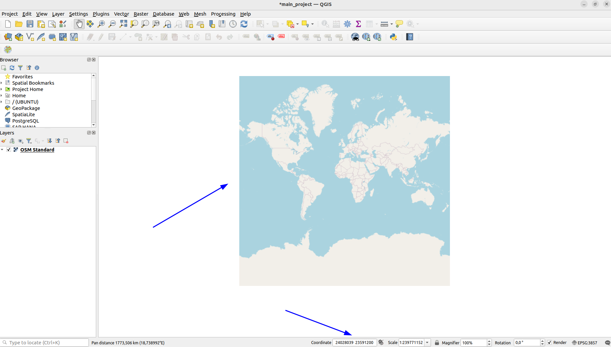

Take a look at the `Coordinate` field in the footbar: it no longer displays geographic coordinates in degrees, but rather 2D Cartesian coordinates!

These coordinates are in the 2D reference system of the projected CRS Pseudo-Mercator (EPSG:3857), which uses the Mercator map projection. With a different projected CRS, we would have a different 2D reference system and thus different coordinates.

We can see that QGIS has dynamically projected the OpenStreetMap map to the EPSG:3857 CRS. This is known as **on-the-fly projection**, a tremendously useful feature which allows to load geographic data with coordinates in various CRSs and to display them in a single coordinate system.

This illustrates an key property of geographic data: **each source of geographic data has its own CRS**. The GIS software dynamically reprojects the data to a unified CRS, but it **does not modify the CRS of the data itself**. 
Here, QGIS has never actually altered the coordinates of the OSM basemap, the images are simple reprojected before being displayed on the map view.

This implies that two data layers can overlay in the map view, while actually being in very different coordinate reference systems. This is often misleading to new GIS enthusiasts and may lead to unexpected results in spatial analysis and processing. 
QGIS is mostly able to perform calculations on vector data in different CRSs without any trouble, but some operations on rasters (or vector+rasters) still require the CRS of all input data to be the same.

A good practice is to ensure that all the data being processed is in the same CRS to avoid any issue.
Later in the tutorial, we will see how to truly change the CRS of a data layer, rather than just reprojecting it in the QGIS map view.

---

 **Don't forget to save the project !**

# D. Adding more geodata

Now that we have covered the basics of the QGIS interface and map projections, let's load some more data into QGIS.

### a. Adding the Meilenbmätter von Sachsen from a remote Web Map Service

[**Web Map Service**](https://www.ogc.org/standard/wms/) (WMS) is a standard protocol published by the [Open Geospatial Consortium](https://www.ogc.org/)  for delivering georeferenced maps over the web as data streams.
With WMS, you can share and load georeferenced map images that would largely exceed the capabilities of mainstream computers.

The _Hochschule für Technik und Wirtschaft Dresden_ has published as a WMS the largest historical map of Saxony made from high resolution digisations of the ~300 [_Meilenblätter von Sachsen_](https://de.wikipedia.org/wiki/Meilenbl%C3%A4tter_von_Sachsen).

---

> 🛠️

Let's load this map into QGIS.
We first need to configure the connection to the HTW-Dresden WMS server. To do this, go to the `Layer -> Data Source Manager` menu, then select the `WMS/WMTS` tab, and click on `New` to add a new WMS source:
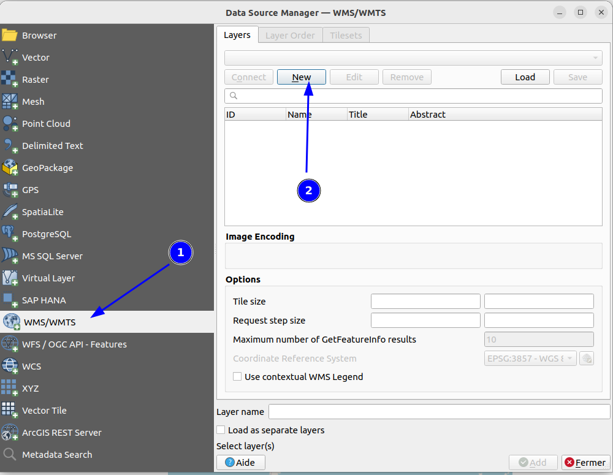

Then enter the connection details for the server at the URL below, and click OK:
Here is the servers' URL to copy-paste:
```
https://geoinformatik.htw-dresden.de/ms/mbl
```
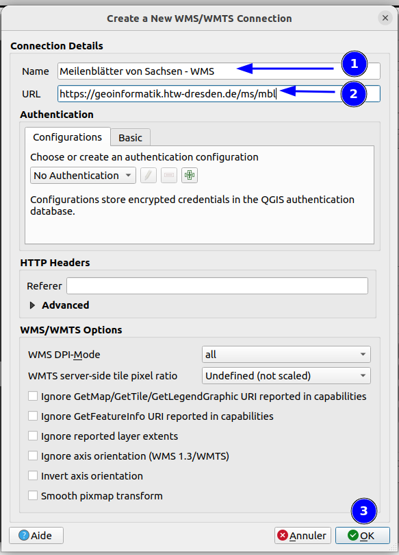

The WMS server should now be available in the `WMS/WMTS` panel.
All you need to do now is click `Connect` to display the list of available maps.

As shown in the figure below, select the layer number 5 named *Meilenblatt_V* (1), then click Add (3).
Check that the *coordinate reference system* selected for this layer is indeed `EPSG:3857` (2).

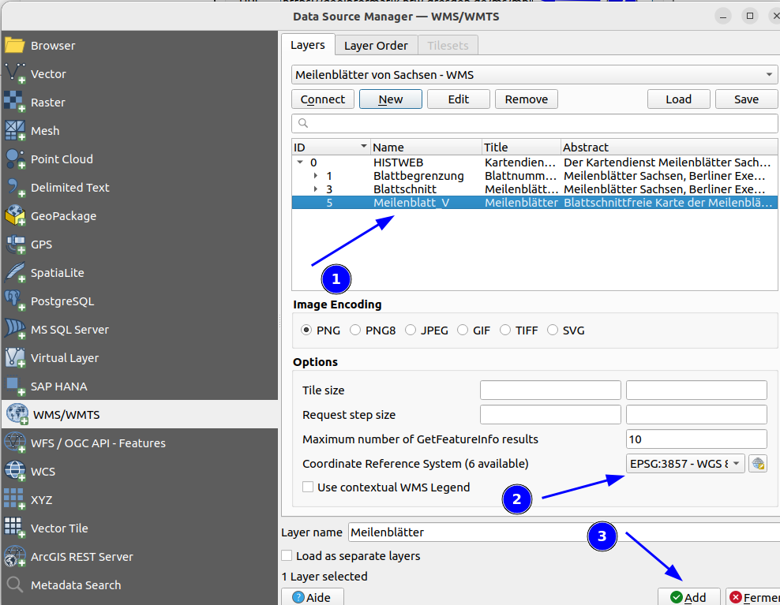

*Et voilà* ! The georeferenced map of Meilenblätter should now show on top of the OpenStreetMap basemap in the main map view !

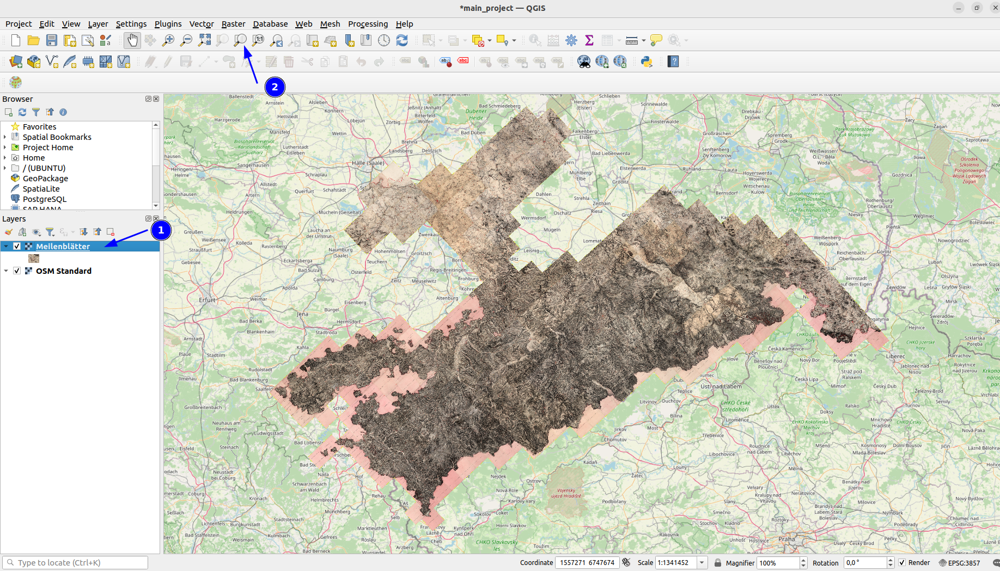


>ℹ️ If the Meilenblätter layer appear in the Layers panel but is not visible on the map view, you can force QGIS to zoom to the layer. Select the layer  `Meilenblätter` in the Layers panel, then clicking the map tool `Zoom to Layer` in the QGIS main toolbar.

>ℹ️ The arrangement of the layers in the Layers panel reflects the order in which they are displayed in the map view, in descending order. Therefore, one layer *below* another in the layers panel is also displayed *below* the other in the map view. 
>You can change this order very easily by  moving the layers with a simple drag and drop in the Layers panel.

---

 **Don't forget to save the project !**


### b. Loading the places from the Historisches Ortsverzeichnis von Sachsen from a CSV

We have so far only used georeferenced images. This kind of geographic data is referred to as **raster data**, i.e. they are made of a multi-dimensional matrix of pixels. The geographical entities they portray are not structured as digital data but that could be queried, processed, enriched with attributes,... 

At the other end of the geographic data spectrum, **vector** data are structured digital entities composed of a set of attributes and a discrete geometry shape (a point, polyline, polygon, etc.). 

In simple terms, we could say that vector geospatial data is a single row in an Excel-type table, with a column containing its coordinates.

Broadly speaking, a vector data is a line in an Excel spreadsheet, with a special column containing it geometry, and raster data are images with geographical coordinates.

In fact, QGIS can actually process an Excel spreadsheet as if it were a set of vector data.

---
> 🛠️

Let's try this with the file `Tutorial_1/data/hov_places.csv`. The extension `.csv` is short for Comma Separated Values,  a very simple text-based datatable format where cells are separated by a special character. CSV are typically created from spreadsheet programs such as Excel or LibreOffice Calc.

>ℹ️  If you open this file in Open/LibreOffice Calc or Excel (in Excel you may have to go to the tab `Data` and select `from text` ), or in any other text editor, you will see that each line corresponds to a named place and that it contains two columns named `lon[gitute]` and `lat[itude]` containing the point coordinates of this place.

To load this file into QGIS, go to the menu `Layer->Data Source Manager` and follow these steps:
1. Open the tab `Delimited Text` 
2. Click on the button  to the right of *File Name* to fetch and parse the content of `Tutorial_1/data/hov_orte.csv` .
3. ⚠️ Check that the encoding is `UTF-8` (especially on Windows and MacOS!) and the File Format set to CSV
4. Tell QGIS where to find the geometry of each place in `Geometry Definition`: 
	- "Point coordinates" means that geometries are simple points whose coordinates are in separate columns. Here, the `X field` (i.e. "east/west") is the column `lon` and the `Y field` is the column `lat`.
	- Set the Geometry CRS. Be careful, the table contains geographic coordinates, not projected ones, so the CRS is **EPSG:4326 (WGS 84)** and not EPSG:3857. On-the-fly projection will display everything in Pseudo-mercator anyway.
5. Click "Add" and then "Close"


The result should resemble the figure below (colours may vary):


QGIS maps only the positions of the HOV loaded from the CSV, however the whole data table has been imported with much more information, like the place name, suface and so on.

Let's confirm that all the data has indeed been loaded by looking at the layer's **attribute table**, which contains all the non-geometric attributes of the HOV places.

Right-click (on MacOS: Command + click) on the layer  `hov_places` in the Layers pane, and select `Open Attribute Table` .

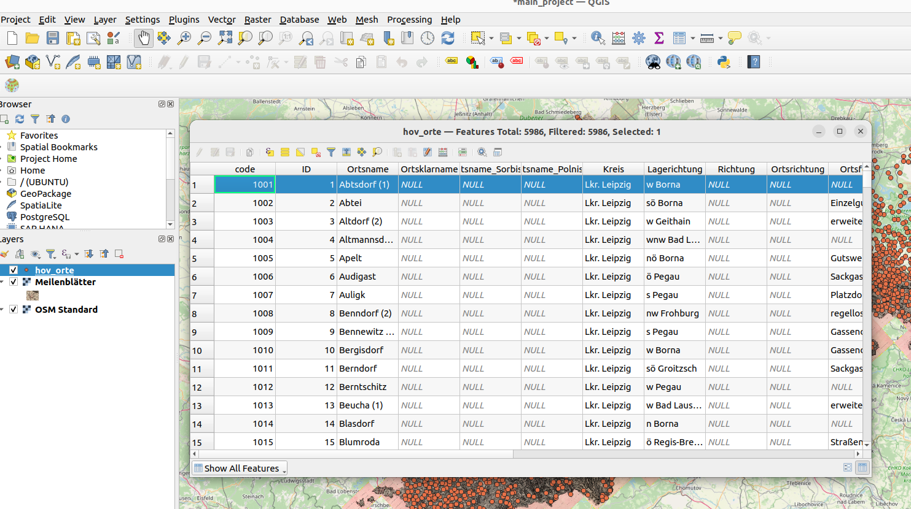

The attribute table can be used to add or delete fields from a vector layer, to edit field values, to calculate new fields from complex expressions...  

>ℹ️ The attribute table will not be explained any further in this tutorial, but if you want to delve deeper into this subject, QGIS has a very comprehensive tutorial available at https://docs.qgis.org/3.28/en/docs/user_manual/working_with_vector/attribute_table.html


 **Don't forget to save the project !**


### b. Loading a subset of the road network in the Meilenblätter, in vector format

We have seen an example of point data loaded from a CSV data table, but many more formats exist, that have been specially designed for geospatial data.

One of the most common formats is GeoJSON, wich is the standard for Web REST APIs and is widely used to publish and share vector geospatial data.

---
> 🛠️

In the `Tutorial_1/data/` folder is a file called `road_network.geojson`. It contains a piece of the road network visible on the Meilenblätter, in vector format.

Let's open it in QGIS. To do this, you have two options:
1. simply drag and drop the file to the QGIS map view. ⚠️ On Windows and MacOS it is safer to use method 2 to prevent QGIS to automatically chose the encoding based on the Locale, wich might not be UTF-8 on these two operating systems;
2. or go to `Layer->Data Source Manager` and open the file from the tab `Vector`. Here, specify the encoding to be UTF-8.

The layer should be added to the map and visible to the North of Zwickau:


>ℹ️ Of the 4 layers opened, 2 are stored in the cloud (OSM and the Meilenblätter), and 2 were imported from local files. Because the reference to the layer sources (WMS URLs or file paths) are saved in the project file, all layers will be loaded automatically.
>However, the data is **never actually stored in the project file**, but is simply loaded when the project is opened. So, if you want to copy your QGIS to another computer, or create a nackup, do not forget to **copy the data files along with the QGIS project file**.

 **Don't forget to save the project !**

# E. Playing with symbology

Both vector layers loaded are displayed on the map with an automatically generated style, usually quite ugly and not relevant.

This is an opportunity to experiment a little with the QGIS map symbolisation engine.

### a. Displaying HOV places with their names

Let's start with the `hov_places` layer.
We have already seen that each point is associated with a set of attributes that do not appear on the map, but are accessible from the layer's attribute table .

---
> 🛠️

One of these attribute is the place's name, stored in the field/column `Ortsname`.
Let's display it on the map, to make browsing easier!

Everything related to the symbolization of a layer is available in the `Layer properties` which can be opened either by right-clicking on the layer in the Layers Pane and choosing the `Properties...` option, or from the `Layer->Layer Properties` menu.

This will open a window with a number of tabs. Choose the `Labels` tab (1, see below) and specify in (2) that you want to display `Single Labels`:
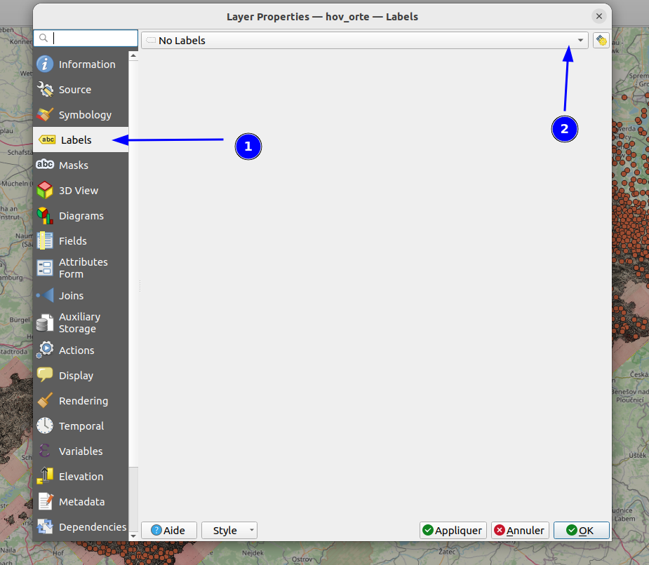

This will unlock all the labeling options for the `hov_places` layer:
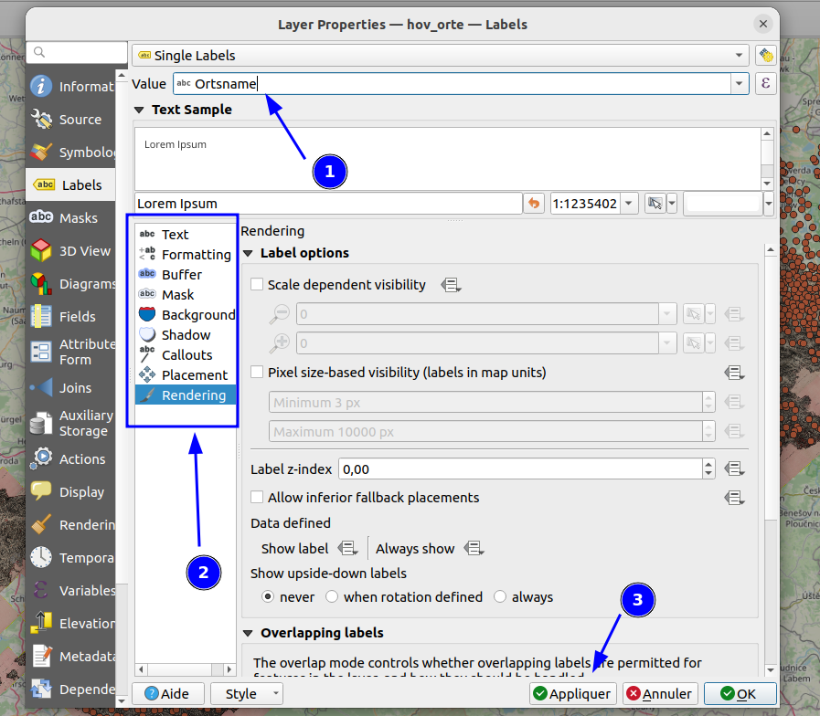

First, select the data field to be used as the label (1): **Ortsname**.

Using the various tabs in the panel (2), create the labels:

- in Arial font, bold, size 3.5 millimetres
- surrounded by a 1 millimetre white buffer
- placed around the point at a distance of 0.5 millimetres
- whose visibility depends on the scale, and which are hidden beyond 1:300,000.

**Bonus excercise**
Use the expression builder in  `data-defined Override -> Edit`   (see fig. below) to toggle the scale-dependant visibility only for places with ` Flaeche_in_ha_integer` less than 1000 ha.

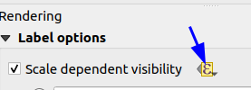

The result should look like this:


### b. Categorized symbols on the road network

Let's now consider the layer `road_network`.

Looking at its attribute table, we see that it contains a field named `category`, which is the nature of this road according to the legend of the Meilenblätter:


---
> 🛠️

Let's create a different symbology for each category of road.

Open the properties of the `road_network` layer, then the `Symbology` tab and choose a `Categorized` symbology. 
Apply this categorisation to the `category` field and click `Classify` once to generate a legend line for each category:
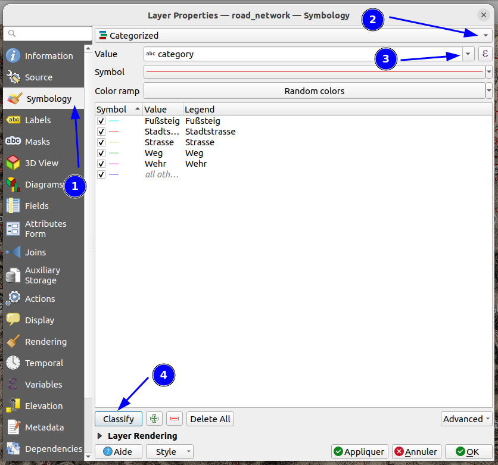

Click on `Apply` to see the results of this first rough automatic styling.

You can now finely adjust the symbolisation of each category by selecting each line of legend, and then clicking on `Symbol` to open the `Symbol Selector` window.

Create a specific style for the `Strasse` category. 
Let's recreate the style of the roads depicted on the Meilenblätter in the area covered by the vector network
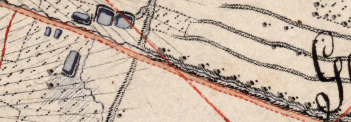

The symbol is a double red line, one side solid and the other dashed, with an orange background.

To do this, in the `Symbol Selector` window in the *Strasse* category, you can stack strokes symbols and use the `offset` parameter to create different borders. 
For example:

1. A solid `Simple Line` of width 1.5 mm, coloured in semi-transparent orange...
2. ...overlayed by a second `Simple Line` , dashed, of width 0.5mm, with an offset of 0.8mm.
3. ...overlayed by a third `Simple Line` , solid, also of width 0.5mm, with an offset of -0.8mm.


Once you're done, click on `OK` and then `Apply` to see the result:

>ℹ️  Unlike `OK`,  the  `Apply` button does not close the Symbolization window, wich makes super easy to experiment with the symbology in a trial&error approach !

The roads should now be displayed in the style of the *Meilenblätter*:
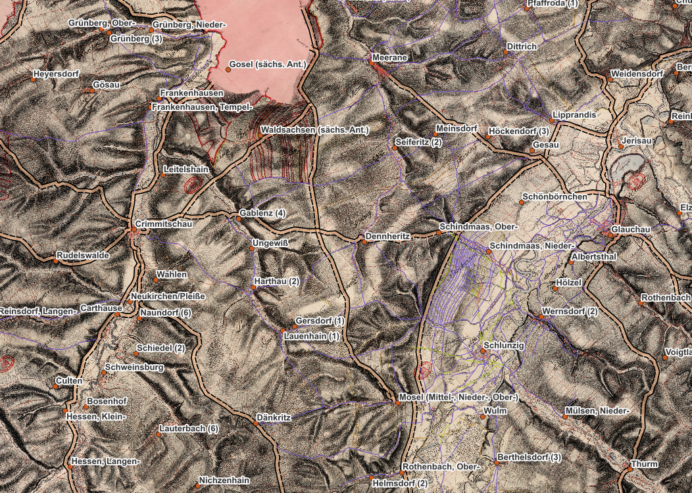

 Using on the legend of the Meilenblätter, create a symbol for each remaining road category that resemble the actual symbolisation on the historical map.

In the case of `StadtStrasse`, wich is not in part of the above legend, simply set a thin black line !


 **Don't forget to save the project !**

# F. Geospatial processing: mapping a one-day walking trip in the Meilenblätter

Now that all the data layers have been loaded, it is time to experiment with some of the the geospatial processing capabilities of QGIS. 

In this section, we're going to compute and map the area that could be covered by an individual travelling on foot on the road network depicted in the Meilenblätter.

>❗ Obviously, this is only a learning exercise with no scientific ambition. In order for the result to be more realistic, much more information would be needed: the full fine-grained raod network (footpaths are missing, the network storps at the map limits, ...), the DEM to determine the elevation of each road, and so on.

Let's proceed in several steps that build on each other.


## a. Step #1:  Computing the network accessibility from a given point

Firstly, we need to know which part of the road network can be reached from a given starting point in a given time.

QGIS offers a large number of processing options, accessible from the `processing->Toolbox` menu. 
The one we're interested in is `Service Area (from point)` available in the category `Network Analysis`. 
Double-click on the processing to open its settings window.
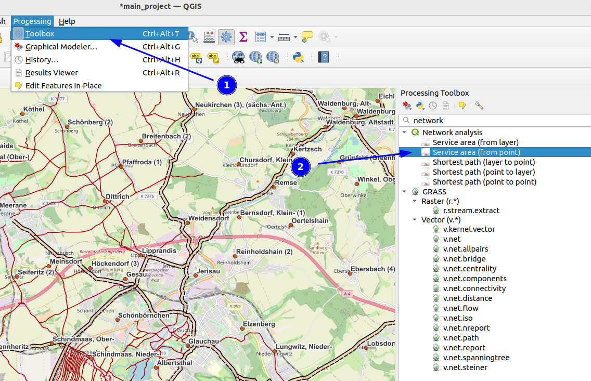

>ℹ️   For more details about the Network Analysis tools,  check the doc : [https://docs.qgis.org/3.28/en/docs/user_manual/processing_algs/qgis/networkanalysis.html](https://docs.qgis.org/3.28/en/docs/user_manual/processing_algs/qgis/networkanalysis.html)

Let's take a closer look at the prameters required by the `Service Area` processing:
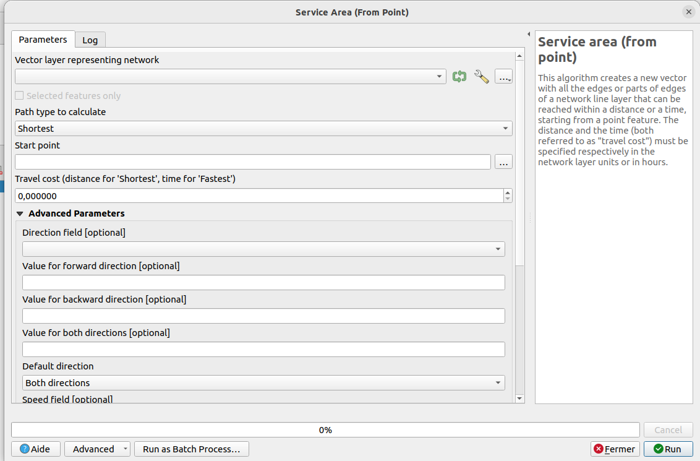

1. Obviously, we need a *navigable* network for routing calculation to be possible. Lucky for us, this is the case for `road_network` 🙂 Select this layer in the `Vector layer representing network` field.
2. `Path type to calculate` takes two possible values, depending on whether the service area is based on a distance or time budget. With `Shortest`, we look for the portion of the network that can be reached within a certain distance. Conversely, `Fastest` determines the subnetwork reachable in a given time. `Fastest` is the relevant value for us, switch the path type value accordingly.
3. Let's skip `Start point` for now.
4. `Travel cost` is the available time budget **in hours**. Set a plausible value for a full day of walk, say **7 hours**.
5. In *Advanced Parameters* we need to set a value for the `Default Speed`. Set it to **4 km/h**.

We're almost done ! 
Let's now chose the the starting point of the trip.

Click on the `[...]` button to the right of `Start Point` to activate a coordinate picker. Click on the map to define this position as the starting point. Be careful to chose a location **close to the network**.

>ℹ️   Right click anywhere to deactivate the coordinate picker and go back to the processing window.

The final processing configuration should be similar to the figure below. Now all you have to do is hit `Run` !


A new layer named `Service area (lines)` should have been added to the project: this is the sub-network that can be reached in 7 hours by walking at 4 kilometers/hour from your chosen starting point. 

For example, here's the part of the network accessible from *Schlunzig*:
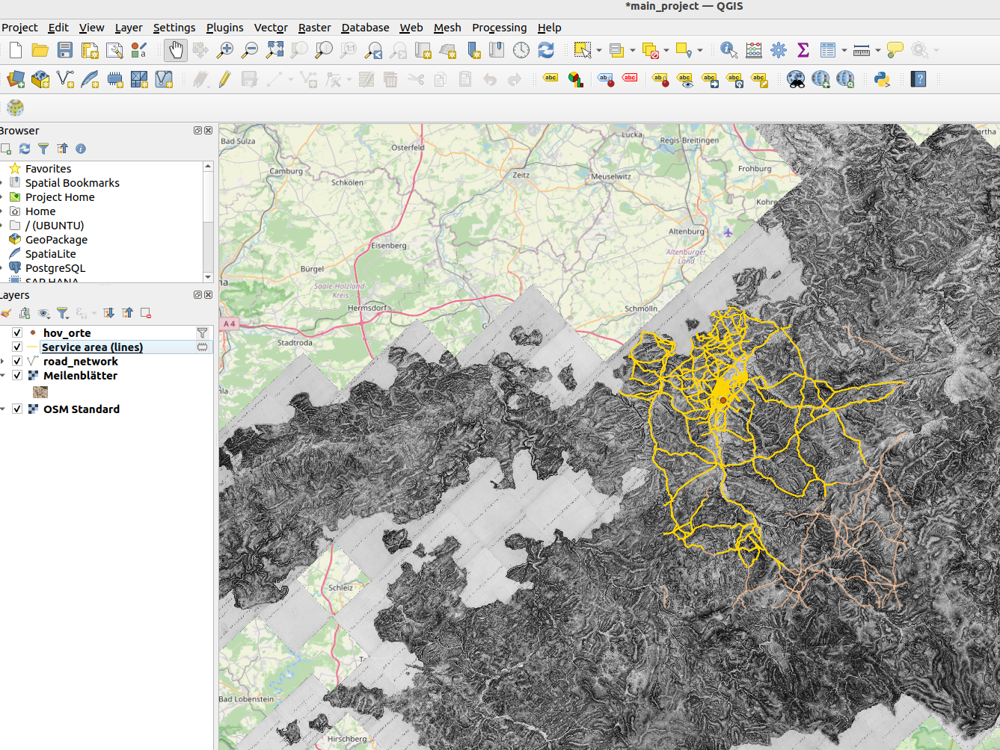

## b. Step #2:  Creation of an approximate *accessible area*.

Now that we know which roads are accessible from the chosen starting point, we can construct an approximate polygon of the area that can be covered in a day's walk.

Let's say that once a point in the network has been reached, a traveler can still cover around 1 kilometer as the crow flies to reach his final destination.

A rough but very simple way of representing this area is to create a buffer zone around the accessible road segments.

However, linear network geometries are too complex for buffer zone calculation to be successful on a laptop. We need to pre-process the `Service Area` layer to simplify the road geometries.

This pre-processing involves several steps:
1. the network visible in the `Service Area` layer is in fact a single entity with a complex geometry. This can be verified by using the geometry selection tool ![[icon_select.png]] in the QGIS toolbar, then clicking on a network line in the map view. The selected entity is displayed in yellow: you can see that the entire network turns yellow. The first thing we want to do is explode this network into smaller entities corresponding to road sections. To do this, go to `Vector->Geoprocessing Tools-> Dissolve`, check the option *keep disjoint features separate* and apply the operation on the layer `Service Area` .  This will create a new temporary layer `Dissolved` made of mutliple road segments (you can check with the selection tool ![[icon_select.png]]).
2. Now we can simplify the segments geometries. Go to `Vector->Geometry Tools-> Simplify` and apply a *Douglas-Peucker* algorithm on the layer `Dissolved` with a tolerance of 500 meters. This will create a third temporary layer names `Simplified`. Check on the map view how the new segments have a lesser number of intermediary nodes.


We can now safely create the buffer area from the simplified road network.

Open the `Buffer` processing from the  `Vector->Geoprocessing tools` menu and configure the algorithm as such:


Run the processing to generate a layer `Buffered` containing the buffer of 1 kilometer around each road.

This layer contain multiple polygons, but we actually want a single polygonal area.

The ultimate step is to merge all these buffers into one single entity, using the processing `Vector->Geoprocessing Tools-> Dissolve` again on the temporary layer `Buffered` to create the final area:


## c. Step #3: Saving the final buffer area to a file


So far, we've been able to generate temporary files, stored in memory. These will disappear when QGIS is closed. They are indicated in the Layer Panel by a small chipset icon:

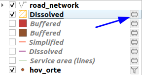

Let's take a look at how to save the final `Dissolved` layer, containing the 1km buffer zone around the subnetwork that can be reached in 1 day on foot.

To do this, right-click on the layer in the Layer Panel and choose `Export->Save features As...`, or select the layer in the Layer Panel and go to `Layer->Save As...` in the main menu.

We'll stick with the GeoJSON format. Click on `[...]` next to `File Name` to choose the location and name of the output file: name it `tutorial_1_buffer_area` and save it in the working directory.

Ensure that the CRS is EPSG:3857. Also, you can safely deselect the fields `type` and `start`: they are artefacts from the previous processings. 
Finally, click on `OK` to create the file. The result should be automatically loaded into QGIS.

You may now want to delete all the temporary layers created until now, as, anyway, they will not be saved.

# G. Composing a map of the accessible area from a place, in the Meilenbmätter road network


**This last exercise will be carried out collectively during the session, in order to keep the tutorial to a reasonable length.**

